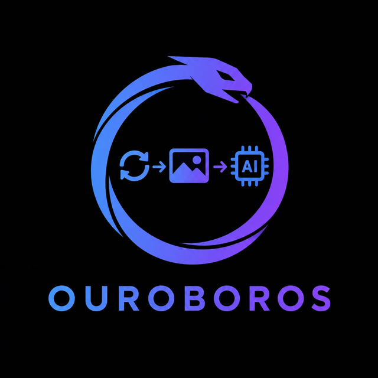

<h1 align="center"></h1>

Give it a reference image and a prompt, and Ouroboros keeps generating with ComfyUI, judging
each result against the reference with a vision LLM, and adjusting the prompt and settings
until the image matches. It's the "render, ask an AI what's off, tweak, repeat" loop,
automated, with a local web UI.

## How it works

Each round:

1. **Render** a few candidates in ComfyUI (SDXL), from your workflow.
2. **Judge** them: a vision LLM scores each against the reference on a fixed rubric
   (character, composition, style, colour, quality) and says what to change.
3. **Edit** the prompt, LoRAs, seed or denoise as the judge suggests, then go again, until
   the score passes your threshold, stops improving, or runs out of budget.

Queued jobs run one after another. There's also a **Home** tab for one-off renders with your
own settings (queued, so you can keep adding more), a **History** of everything generated, and
a **LoRA** browser.

**Auto-fix** checks a finished image on its own for things that look wrong (six fingers,
impossible joints, a pinched waist, melted faces, artifacts), repaints just those regions,
and keeps the result only if a before/after review says it's better. It can run after any
generation, after automatic runs, or on any image in History.

The judge can be a hosted model on [DeepInfra](https://deepinfra.com) (default, a fraction of
a cent per round), a model in [Ollama](https://ollama.com) on your network, or OpenAI.

The design and every mechanism are described in [IMPLEMENTATION.md](IMPLEMENTATION.md).

## Requirements

- **Python 3.13** (pinned in `.python-version`; [pyenv](https://github.com/pyenv/pyenv) recommended)
- **[ComfyUI](https://github.com/comfyanonymous/ComfyUI)** with an SDXL checkpoint (built
  around Pony/Illustrious) and these custom nodes:
  - [rgthree-comfy](https://github.com/rgthree/rgthree-comfy)
  - [WAS Node Suite](https://github.com/ltdrdata/was-node-suite-comfyui)
  - [ComfyUI-Inpaint-CropAndStitch](https://github.com/lquesada/ComfyUI-Inpaint-CropAndStitch)
  - [ComfyUI_IPAdapter_plus](https://github.com/cubiq/ComfyUI_IPAdapter_plus) with its SDXL
    ViT-H adapters and CLIP vision model ([h94/IP-Adapter](https://huggingface.co/h94/IP-Adapter))
  - optional, for poses: [xinsir ControlNet Union SDXL](https://huggingface.co/xinsir/controlnet-union-sdxl-1.0)
    (`xinsir_union_sdxl_promax.safetensors`)
- An API key for the judge (DeepInfra or OpenAI), or an Ollama server with a vision model

## Install

```bash
git clone <this repo> ouroboros && cd ouroboros
pyenv install --skip-existing
pyenv exec python -m venv .venv
.venv/bin/pip install -r requirements.txt
```

It works out of the box with the included `workflows/example_workflow.json` (uses the
Pony Diffusion V6 XL checkpoint by default; pick any SDXL checkpoint in the UI). To use your own
ComfyUI workflow instead, export it with *Workflow → Export (API)* into `workflows/`, copy
`workflows/nodes.example.json` to `workflows/nodes.json`, and set its file name and node ids.

## Run

```bash
./run-ouroboros.sh
```

On Windows, double-click `Run Ouroboros.bat`. The UI opens at http://127.0.0.1:8765. If
ComfyUI isn't already running, Ouroboros starts it in the background. It finds a Comfy
Desktop install by itself; for another install, set `comfyui.python` and `comfyui.main` in
`config.json` (or just start ComfyUI yourself and set its URL under Settings → Connections).

In **Settings**, add your judge's key under **API keys**, then pick the judge model. The
pills at the top show when ComfyUI, the judge and the workflow are ready.

Your settings are saved to `config.json` and your keys to `api_keys.json`; neither is
committed.

Settings offers separate models for visual judging, prompt writing/edit planning, and
confirmation on the selected provider. Choosing a model fills its recommended options;
save the form to apply them. Confirmation must pass independently, with separate
thresholds for automatic runs and character edits. Their scoring rubrics are different.

**Compare & zoom** on character-edit candidates and automatic-run results opens the
reference and candidate together, with linked zoom, scrolling and dragging.

To compare the DeepInfra candidates and current baselines on your own labelled images:

```bash
.venv/bin/python -m ouroboros.model_benchmark
```

This sends the images in `eval/judge_set.json` to DeepInfra and incurs API charges.
It compares two configurations per model, repeats the full review and confirmation
sets, and checks prompt writing and multiple-image input. It stops starting calls once
recorded spending reaches $15 (requests already in flight can finish). Raw evidence is
saved under `eval/results/profiles-*/`; successful tested profiles are cached in
`eval/model_profiles.json` and take precedence over built-in recommendations. These
are the best settings among those tried, and fitted thresholds remain provisional
until validated on a separate image set. Designer thresholds are not inferred from
the automatic-run evaluation set.

If you use a classified LoRA library ([lora-classifier](IMPLEMENTATION.md#one-lora-library)
output in `loras.catalog_dir`), write the short LoRA descriptions the AI chooses LoRAs by once,
and again after adding LoRAs:

```bash
.venv/bin/python -m ouroboros briefs
```

## More

- [IMPLEMENTATION.md](IMPLEMENTATION.md): how the loop works, the judge and its rubric,
  LoRA selection, poses, the IP-Adapter, the hand refiner, and every setting.
- Headless mode: `.venv/bin/python -m ouroboros run` processes the queue without the UI.
- Tests (no ComfyUI or LLM needed): `.venv/bin/pip install -r requirements-dev.txt`, then `.venv/bin/python -m pytest`.

## License

[MIT](LICENSE)
